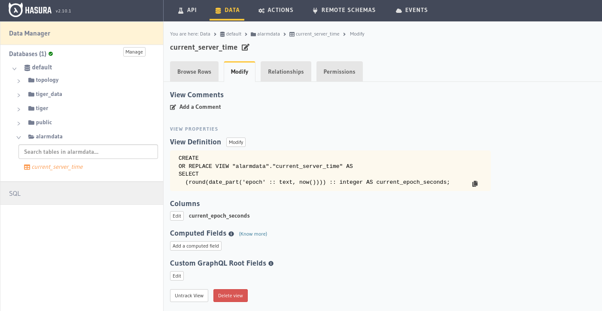

# Apollo3 Hasura Sample

## Prerequisites
* Docker
  * Docker Swarm Initialized
    * just run `docker swarm init`
* JDK, probably 11 or 17? Not sure if gradle downloads it.

### Setup
* Start the local postgres and hasura
  * from this directory run `docker stack deploy -c docker-compose.yaml hasura`
* Open [Hasura Console](http://127.0.0.1:7070)
  * Enter admin secret `gimcrack-chief-ohmmeter-wurst`
  * On the Data Tab in Hasura,
     1. Create the `alarmdata` schema
     1. Create Table `CREATE VIEW alarmdata.current_server_time AS SELECT ROUND(EXTRACT(EPOCH FROM now())) ::INTEGER AS current_epoch_seconds;`
     1. Do Remember to track the table :)
     1. For us it looks like this
    
* Download GraphQL Schema
  * On Console, in this directory, run `./gradlew downloadApolloSchema`
* Then run main function App.kt like this `./gradlew run`
  * Confirm looking at docker logs for 
  * e.g. see the logs for service: `docker service logs hasura_graphql-engine --follow`
  * Change the `useGraphQLWsProtocol = true` in App.kt and run again

* The Relevant Change is in App.kt lines 31-33
```kotlin
if (useGraphQLWsProtocol) {
    webSocketNetworkTransportBuilder.protocol(GraphQLWsProtocol.Factory()) // Default is SubscriptionWsProtocol when not provided
}
```